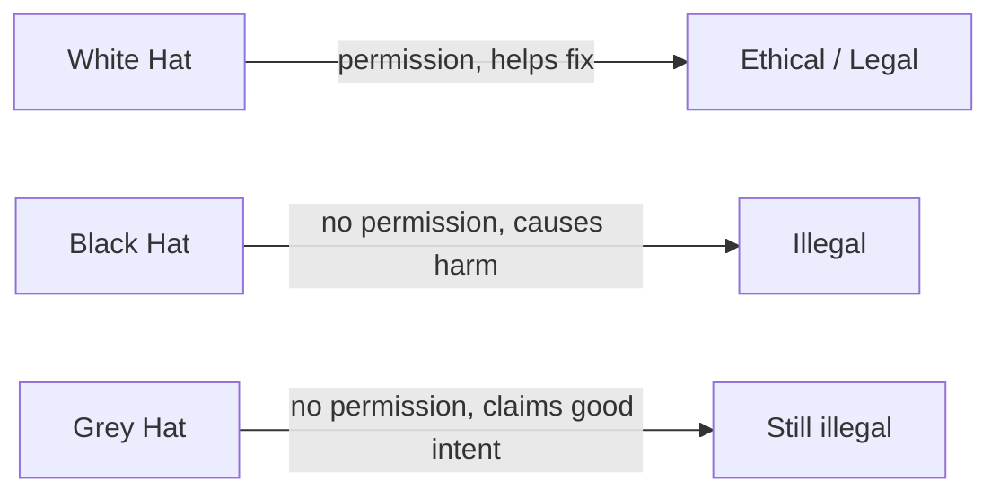

# Lesson 00 — Ethics & Safety

Before touching any tool, read this. Cyber security skills are powerful. Using
them the right way makes you a **defender**. Using them the wrong way is a
**crime**.

## The one golden rule

> Only test systems you **own** or have **explicit written permission** to test.

That's it. If you don't have permission, don't do it — even "just to see if it
works".

## What is allowed in this course

- Anything **inside this container** (it's your own disposable machine).
- The official **public practice targets** below, which the owners have set up
  for learning:
  - `scanme.nmap.org` — Nmap's legal scanning playground.
  - `testphp.vulnweb.com` — Acunetix's deliberately vulnerable demo site.
  - `http://demo.testfire.net` — a fake bank for practice.

## What is NOT allowed

- Scanning, attacking, or "testing" your school network, your friends' devices,
  websites, game servers, or anyone else's systems.
- Trying to access accounts, data, or Wi-Fi that isn't yours.

## Why it matters

| Action                       | Outcome                             |
| ---------------------------- | ----------------------------------- |
| Practising on legal targets  | You build real, employable skills   |
| Attacking without permission | Suspension, police, criminal record |

## Key vocabulary

- **Vulnerability** — a weakness in a system.
- **Exploit** — code or steps that take advantage of a vulnerability.
- **Penetration test (pentest)** — a _permitted_ simulated attack to find and
  fix weaknesses.

## ✅ Check your understanding

1. Your friend says "scan my phone". Are you allowed to? Why or why not?
2. Name two targets you _are_ allowed to scan in this course.
3. What is the difference between a vulnerability and an exploit?

➡️ Next: [Lesson 01 — Linux Command Line](01-linux-command-line.md)
