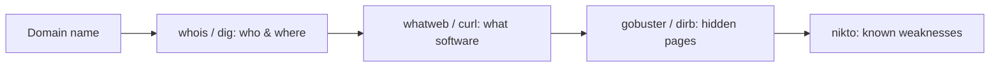

# Lesson 05 — Web Reconnaissance

Most hacking targets are **websites**. Recon ("reconnaissance") means gathering
information about a web server _before_ deciding anything else. Good defenders
do this to find their own weak spots first.

> [!IMPORTANT]
> Practise only on the legal demo site **`testphp.vulnweb.com`** (built to be
> hacked for learning) or your own container. Nothing else.

## 1. Who is behind a domain?

```bash
whois vulnweb.com | less        # registration info (press q to quit)
nslookup testphp.vulnweb.com    # find the IP address
dig testphp.vulnweb.com         # more detailed DNS lookup
```

## 2. What is the server running?

```bash
# whatweb fingerprints the technologies a site uses
whatweb http://testphp.vulnweb.com
```

```bash
# curl shows the raw HTTP response headers (-I = headers only)
curl -I http://testphp.vulnweb.com
```

Look for headers like `Server:` and `X-Powered-By:` — they leak software names.

## 3. Find hidden pages and folders

Web servers often have pages that aren't linked anywhere. `gobuster` guesses
common names from a wordlist.

```bash
gobuster dir -u http://testphp.vulnweb.com \
  -w /usr/share/wordlists/dirb/common.txt
```

`dirb` does the same job with a simpler command:

```bash
dirb http://testphp.vulnweb.com
```

## 4. Scan for known issues

`nikto` checks a web server against a database of common problems.

```bash
nikto -h http://testphp.vulnweb.com
```

## Recon workflow



## ✅ Challenge

1. What web server software does `testphp.vulnweb.com` report in its headers?
2. Use `gobuster` and list two folders or files it discovered.
3. Pick one issue `nikto` reported and explain in your own words why it could be
   a problem.

➡️ Next: [Lesson 06 — Steganography](06-steganography.md)
